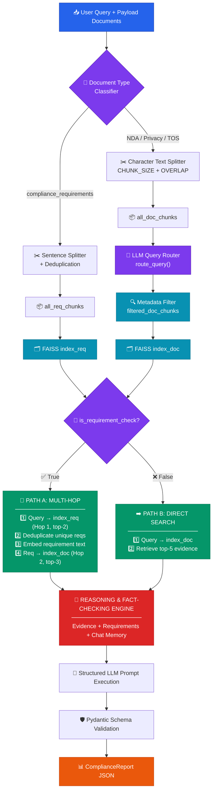

<div align="center">

# ⚖️ Multi-Document Contract & Legal Compliance Analyzer

### 🤖 An AI agent that audits legal contracts against compliance requirements — automatically.

<br>


<br>


</div>

---

<div align="center">

### 📑 Table of Contents

[**1. Project Description**](#-1-project-description) • [**2. AI Service**](#-2-ai-service) • [**3. Back-End**](#-3-back-end) • [**4. Front-End**](#-4-front-end) • [**5. Contributors**](#-5-contributors)

</div>

---

## 📋 1. Project Description

> An enterprise document audit agent that ingests multiple legal agreements — **NDAs**, **Terms of Service**, and **Privacy Policies** — and audits them against a central compliance requirements document.

### 🎯 The Problem

Reviewing contracts for compliance is **slow** and **error-prone**.

A requirement like *"all customer data must be encrypted at rest using AES-256"* lives in one document, while the clause that satisfies — or violates — it lives somewhere in a **completely different contract**. Finding those connections by hand means reading every document and holding all the rules in your head at once.

### 💡 The Solution

This system automates that cross-document comparison. You ask a question → it figures out which requirements are relevant → finds the matching clauses in the right contracts → returns a **structured compliance report** with the exact document, page, section, and quoted text behind every single finding.

### ⚡ Core Capabilities

<table>
<tr>
<td width="33%" align="center">

### 🔍
**Metadata Filtering**

Determines which *types* of documents are relevant before searching. Asking about an NDA only searches NDA content — cutting noise and boosting precision.

</td>
<td width="33%" align="center">

### 🔗
**Multi-Hop Retrieval**

Doesn't just search once. First finds the relevant *requirement*, then uses it to search for evidence in target contracts. **Two hops, two documents.**

</td>
<td width="33%" align="center">

### ✅
**Grounded Reporting**

Every finding must cite real evidence. Uses only retrieved text — never external knowledge. Returns `INSUFFICIENT_EVIDENCE` rather than guessing.

</td>
</tr>
</table>

### 🧪 Example in Action

> **❓ Query:**
> *"Does the Privacy Policy comply with our encryption requirements at rest and in transit?"*

> **🚨 Result:** `NON_COMPLIANT`
>
> The system matched **`REQ-1.1`** (AES-256 at rest, TLS 1.3 in transit), retrieved the Privacy Policy's *Data Security Measures* section on **page 1**, and found that while ✅ TLS 1.3 is correctly used in transit, ❌ data at rest uses **AES-128** instead of the required **AES-256**.

### 🏷️ Compliance Status Types

| Status | Meaning |
|:---|:---|
| 🟢 `COMPLIANT` | Evidence fully satisfies the requirement |
| 🟡 `PARTIALLY_COMPLIANT` | Some conditions met, others missing |
| 🔴 `NON_COMPLIANT` | Evidence directly contradicts the requirement |
| ⚪ `INSUFFICIENT_EVIDENCE` | Not enough retrieved text to decide |

---

## 🧠 2. AI Service

> The AI layer is a **Retrieval-Augmented Generation (RAG)** pipeline built with LangChain, FAISS, and Groq. It lives in `ai_service/` and exposes a single entry point: **`analyse(query, files)`**.

### 🗺️ Architecture



---

### 🔄 Pipeline Stages

<details open>
<summary><h4>📄 Stage 1 — Ingestion & Chunking <code>chunking.py</code></h4></summary>

Documents arrive as a `Payload` of `Document` objects, each containing pages with text, page numbers, and section titles. They're split using **two different strategies** depending on type:

| 📁 Document Type | ⚙️ Strategy | 💭 Why |
|:---|:---|:---|
| `compliance_requirements` | Regex sentence split + deduplication | Each requirement is an **atomic rule** evaluated independently |
| Contracts (NDA, Privacy, TOS) | `RecursiveCharacterTextSplitter`<br/>*(1000 chars, 150 overlap)* | Legal clauses need **surrounding context** to be interpreted correctly |

The requirement splitter uses a regex that deliberately **does not** split on periods between digits:

```python
_SENTENCE_SPLIT_RE = re.compile(r'(?<!\d)\.(?!\d)')
```

> ⚠️ **Why this matters:** A naive `.split(".")` would shatter
> `REQ-1.1: ...encrypted using TLS 1.3 protocol`
> into three broken fragments — `REQ-1`, `1: ...TLS 1`, and `3 protocol` — which caused the model to evaluate against a **nonexistent "TLS 1" standard**.

Deduplication also runs here, since policy documents repeat boilerplate across pages.

📌 Every chunk carries full metadata (`document_id`, `filename`, `document_type`, `page_number`, `section_title`) — this is what makes **precise citations** possible later.

</details>

<details open>
<summary><h4>🧬 Stage 2 — Embedding & Indexing <code>embeddings.py</code> · <code>config.py</code></h4></summary>

Chunks are encoded with `sentence-transformers/all-MiniLM-L6-v2` (**384 dimensions**). Vectors are L2-normalized and stored in FAISS `IndexFlatIP` indexes, so inner product becomes **cosine similarity**.

Two separate indexes are built per request:

| Index | Contents |
|:---|:---|
| 🗂️ `index_req` | All requirement chunks |
| 🗂️ `index_doc` | Only the **filtered** contract chunks for this query |

</details>

<details open>
<summary><h4>🧭 Stage 3 — Query Routing <code>reasoning.py</code></h4></summary>

Before any retrieval happens, the query goes to the LLM for **intent classification**, returning a `QueryIntent`:

```python
class QueryIntent(BaseModel):
    is_requirement_check: bool
    target_doc_types: list[str]
```

**🔀 `is_requirement_check`** — Is this a compliance check *("does X comply with...")* or a plain factual lookup *("what does the NDA say about...")*? This decides **which retrieval path runs**.

**🎯 `target_doc_types`** — Which document types matter here: `privacy_policy`, `vendor_nda`, `terms_of_services`, or `all`. **This is the metadata filter.**

> 🛡️ **Safe fallback:** If the filter produces an empty set, the pipeline reverts to searching all documents rather than returning nothing.

</details>

<details open>
<summary><h4>🔍 Stage 4 — Retrieval <code>pipeline.py</code> · <code>retriever.py</code></h4></summary>

#### 🔗 Path A — Multi-Hop *(compliance checks)*

```
1️⃣  HOP 1  →  Search query against index_req  →  top-2 relevant requirements
2️⃣          →  Deduplicate matched requirement texts
3️⃣          →  Embed each requirement
4️⃣  HOP 2  →  Search each requirement against index_doc  →  top-3 evidence chunks
5️⃣          →  Deduplicate evidence across requirements
```

> 💡 **This is what makes the system cross-document:** the query touches the *requirements* file, but the evidence comes from the *contracts*. Two documents that never reference each other get **connected through the embedding space**.

#### ➡️ Path B — Direct Search *(factual lookups)*

A single search of the query against `index_doc`, returning **top-5 evidence chunks**. No requirement hop, because there's no rule to check against.

✨ Both paths converge on the same reasoning step.

</details>

<details open>
<summary><h4>🧠 Stage 5 — Reasoning & Report Generation <code>reasoning.py</code></h4></summary>

Retrieved evidence is formatted into labeled blocks with **full provenance**:

```
Evidence 1:
📄 Document: Customer_Privacy_Policy_v4.pdf
📃 Page: 1
📑 Section: Data Security Measures
📊 Similarity Score: 0.87
📝 Text: ...
```

This goes to the LLM alongside the target requirements and conversation history from `ConversationBufferMemory`, under a system prompt with **strict grounding rules**:

| # | 🔒 Rule |
|:---:|:---|
| 1 | Use **ONLY** the provided requirements and evidence |
| 2 | Do **NOT** use external knowledge |
| 3 | Do **NOT** invent document names, page numbers, sections, or evidence |
| 4 | If evidence is insufficient → return `INSUFFICIENT_EVIDENCE` |
| 5 | Produce **one `Finding` for every requirement** |

Output is constrained through LangChain's `with_structured_output(ComplianceReport)`, so the response is validated against the Pydantic schema **before it's ever returned** — malformed output fails loudly instead of silently passing bad data downstream.

</details>

---

### 📐 Data Schemas `schemas.py`

```python
class Finding(BaseModel):
    finding_id: str          # "F-001"
    severity: Severity       # HIGH | MEDIUM | LOW
    status: ComplianceStatus # COMPLIANT | PARTIALLY_COMPLIANT |
                             # NON_COMPLIANT | INSUFFICIENT_EVIDENCE
    requirement: str         # the exact requirement evaluated
    document: str            # source filename
    page: int                # source page
    section: str             # source section title
    evidence: str            # exact quoted supporting text
    analysis: str            # why this status was assigned
    recommendation: str      # concrete remediation action


class ComplianceReport(BaseModel):
    status: ComplianceStatus # overall posture
    summary: str             # 2-4 sentence overview
    findings: list[Finding]
```

> 🔎 **Every finding is traceable** back to a specific page and section of a specific document.

---

### 💬 Conversation Memory

`ConversationBufferMemory` is injected into the reasoning prompt as `chat_history`, so **follow-up questions retain context** from earlier turns.

`refrech()` clears both the chunk stores and the memory — called when the user refreshes the page to start a clean session. 🔄

---

### 📁 Project Structure

```
ai_service/
├── 🔧 config.py        # Env vars, LLM + embedding model init, constants
├── 📐 schemas.py       # Pydantic models for all data structures
├── ✂️  chunking.py      # Document → Chunk conversion (two strategies)
├── 🧬 embeddings.py    # Text → vector encoding
├── 🔍 retriever.py     # FAISS similarity search
├── 🧠 reasoning.py     # Query routing + LLM reasoning + prompts
├── ⚙️  pipeline.py      # analyse() — orchestrates the full flow
├── 🧪 demo.py          # Local test runner
└── 📦 payload.json     # Sample input documents
```

---

### 🛠️ Tech Stack

| Component | Technology |
|:---|:---|
| 🤖 **LLM** | Groq — `openai/gpt-oss-20b` |
| 🔗 **Orchestration** | LangChain |
| 🧬 **Embeddings** | `sentence-transformers/all-MiniLM-L6-v2` *(384-dim)* |
| 🗂️ **Vector Store** | FAISS `IndexFlatIP` *(cosine similarity)* |
| 🛡️ **Validation** | Pydantic |
| ✂️ **Chunking** | LangChain `RecursiveCharacterTextSplitter` |

---

### 🚀 Setup

**1️⃣ Install dependencies**

```bash
pip install -r requirements.txt
```

**2️⃣ Create a `.env` file in the project root**

```env
GROQ_API_KEY=your_groq_api_key_here
MODEL_NAME=openai/gpt-oss-20b
```

**3️⃣ Run the demo** *(Test AI)*

```bash
cd ai_service
python demo.py
```

---

### 💻 Usage

```python
from schemas import Payload
from pipeline import analyse, refrech

payload = Payload(**your_documents_dict)

report = analyse(
    query="Does the Privacy Policy comply with our encryption requirements?",
    files=payload
)

print(report.status)    # ComplianceStatus.NON_COMPLIANT
print(report.summary)

for finding in report.findings:
    print(finding.requirement, "→", finding.status)

refrech()  # 🔄 clear session state
```

> 💡 **Follow-up questions:** send an empty document list — previously indexed content is reused.
>
> ```python
> report = analyse(query="What about the NDA?", files=Payload(documents=[]))
> ```

---

## ⚙️ 3. Back-End

<div align="center">

### 🚧 *Coming soon.* 🚧

</div>

---

## 🎨 4. Front-End

<div align="center">

### 🚧 *Coming soon.* 🚧

</div>

---

## 👥 5. Contributors

<div align="center">

### Built with ❤️ by a team of four

</div>

<table>
<tr>
<td align="center" width="25%">

### 🧠
**Omar Mohamed**

`AI / ML`

RAG pipeline, multi-hop retrieval, LLM reasoning & prompt engineering

[](https://github.com/oMaR-M-M)

</td>
<td align="center" width="25%">

### 🔀
**Omar Karam**

`Front-End & Back-End`

API layer, session handling, document ingestion endpoints

[](https://github.com/8-Omoshikiii-8)

</td>
<td align="center" width="25%">

### ⚙️
**Omar Shokry**

`Back-End`

*[Contribution]*

[](https://github.com/Omar-Mohamed-2006)

</td>
<td align="center" width="25%">

### 🎨
**Abdullah Sami**

`Front-End`

*[Contribution]*

[](https://github.com/Alex-RavenHolm)

</td>
</tr>
</table>

---

<div align="center">

### ⭐ If you find this project useful, consider giving it a star!

<sub>Built with LangChain · FAISS · Groq · Pydantic</sub>

</div>
