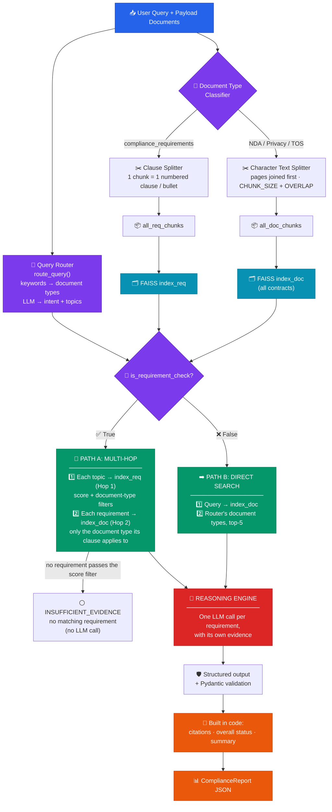
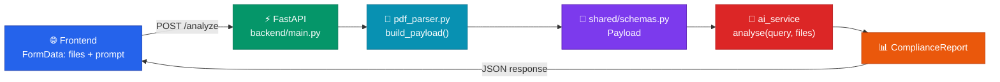

<div align="center">

# ⚖️ Multi-Document Contract & Legal Compliance Analyzer

### 🤖 An AI agent that audits legal contracts against compliance requirements — automatically.

<br>


<br>


</div>

---

<div align="center">

### 📑 Table of Contents

[**1. Project Description**](#-1-project-description) • [**2. AI Service**](#-2-ai-service) • [**3. Back-End**](#-3-back-end) • [**4. Front-End**](#-4-front-end) • [**5. Running the Project**](#-5-running-the-project) • [**6. Contributors**](#-6-contributors)

</div>

---

## 📋 1. Project Description

> An enterprise document audit agent that ingests multiple legal agreements — **NDAs**, **Terms of Service**, and **Privacy Policies** — and audits them against a central compliance requirements document.

### 🎯 The Problem

Reviewing contracts for compliance is **slow** and **error-prone**.

A requirement like *"all customer data must be encrypted at rest using AES-256"* lives in one document, while the clause that satisfies — or violates — it lives somewhere in a **completely different contract**. Finding those connections by hand means reading every document and holding all the rules in your head at once.

### 💡 The Solution

This system automates that cross-document comparison. You ask a question → it figures out which requirements are relevant → finds the matching clauses in the right contracts → returns a **structured compliance report** with the exact document, page, section, and quoted text behind every single finding.

### ⚡ Core Capabilities

<table>
<tr>
<td width="33%" align="center">

### 🔍
**Metadata Filtering**

Determines which *types* of documents are relevant before searching — from the question **and** from the requirement's own clause number (`2.x` → NDA, `3.x` → ToS, `4.x` → Privacy). Asking about an NDA only searches NDA content — cutting noise and boosting precision.

</td>
<td width="33%" align="center">

### 🔗
**Multi-Hop Retrieval**

Doesn't just search once. First finds the relevant *requirement*, then uses it to search for evidence in target contracts. **Two hops, two documents.**

</td>
<td width="33%" align="center">

### ✅
**Grounded Reporting**

Every finding must cite real evidence. Uses only retrieved text — never external knowledge. Returns `INSUFFICIENT_EVIDENCE` rather than guessing. Document, page and section are filled in **by code** from the chunk that really contains the quote.

</td>
</tr>
</table>

### 🧪 Example in Action

> **❓ Query:**
> *"Does the Vendor NDA's confidentiality survival period and breach notification timeline comply with our compliance requirements?"*

> **🚨 Result:** `NON_COMPLIANT` — *Evaluated 2 requirement(s): 2 non-compliant.*
>
> The router split the question into two topics and matched **clause `2.5`** (confidentiality must survive **≥ 3 years**) and **clause `2.4`** (incident notice within **24 hours**). For each one it searched only the NDA:
>
> | Finding | Severity | Evidence found | Verdict |
> |:---|:---:|:---|:---|
> | `F-001` — clause 2.5 · `vendor_nda.pdf` **page 2** | 🔴 HIGH | obligations survive for **two (2) years** | ❌ less than the required 3 years |
> | `F-002` — clause 2.4 · `vendor_nda.pdf` **page 1** | 🔴 HIGH | notice within **five (5) business days** | ❌ contradicts the 24-hour requirement |

### 🏷️ Compliance Status Types

| Status | Meaning |
|:---|:---|
| 🟢 `COMPLIANT` | Evidence fully satisfies the requirement |
| 🟡 `PARTIALLY_COMPLIANT` | Some conditions met, others missing |
| 🔴 `NON_COMPLIANT` | Evidence directly contradicts the requirement |
| ⚪ `INSUFFICIENT_EVIDENCE` | Not enough retrieved text to decide |

---

## 🧠 2. AI Service

> The AI layer is a **Retrieval-Augmented Generation (RAG)** pipeline built with LangChain, FAISS, and Groq. It lives in `ai_service/` and exposes a single entry point: **`analyse(query, files)`**.

### 🗺️ Architecture



---

### 🔄 Pipeline Stages

<details open>
<summary><h4>📄 Stage 1 — Ingestion & Chunking <code>chunking.py</code> · <code>pipeline.py</code></h4></summary>

Documents arrive as a `Payload` of `Document` objects, each containing pages with text, page numbers, and section titles. They're split using **two different strategies** depending on type:

| 📁 Document Type | ⚙️ Strategy | 💭 Why |
|:---|:---|:---|
| `compliance_requirements` | **One chunk per numbered clause** (`2.4 …`, `REQ-1.1 …`) **or per bullet** (`• …`), deduplicated. Everything that is not a requirement (intro, review metadata, the appendix checklist) is dropped | Each requirement is an **atomic rule** evaluated independently, and it keeps its **clause number and heading** |
| Contracts (NDA, Privacy, TOS) | Pages are **joined first**, then `RecursiveCharacterTextSplitter`<br/>*(1000 chars, 150 overlap)* | Legal clauses need **surrounding context**, and a clause that runs across a **page break** must stay in one chunk |

**🧹 Clean-up before splitting** — the running page header (`… | Page N`) that PDF extraction leaves at the top of every page is removed, and the different bullet marks that PDF extractors produce (`•`, `\x7f`, …) are normalized to `• `.

**🏷️ Chunk metadata** — every chunk carries `document_id`, `filename`, `document_type`, `page_number` and `section_title`, which is what makes **precise citations** possible later. For a requirement chunk the `section_title` is its heading line (e.g. `2.4 Security and Incident Notification — Minimum Standard`); the clause number is what tells the pipeline which document type the requirement applies to. For a contract chunk, `page_number` is the page where the chunk **starts**.

**🛟 Fallback** — if a requirements file has no numbered clauses or bullets, the splitter falls back to the previous strategy: a regex sentence split that deliberately **does not** split on periods between digits:

```python
_SENTENCE_SPLIT_RE = re.compile(r'(?<!\d)\.(?!\d)')
```

> ⚠️ **Why the digit rule matters:** a naive `.split(".")` would shatter
> `REQ-1.1: ...encrypted using TLS 1.3 protocol`
> into three broken fragments — `REQ-1`, `1: ...TLS 1`, and `3 protocol` — which caused the model to evaluate against a **nonexistent "TLS 1" standard**.

**♻️ Each document is chunked once.** The frontend re-sends every uploaded file with every message. `pipeline.py` remembers the documents it has already chunked (`_seen_docs`, keyed by `document_id` + `filename`) and skips them. Without this, every question added another copy of every chunk, the top-k results became copies of the same clause, and reports lost findings over the session.

</details>

<details open>
<summary><h4>🧬 Stage 2 — Embedding & Indexing <code>embeddings.py</code> · <code>config.py</code></h4></summary>

Chunks are encoded with `sentence-transformers/all-MiniLM-L6-v2` (**384 dimensions**). Vectors are L2-normalized and stored in FAISS `IndexFlatIP` indexes, so inner product becomes **cosine similarity**.

Two separate indexes are built per request:

| Index | Contents |
|:---|:---|
| 🗂️ `index_req` | All requirement chunks |
| 🗂️ `index_doc` | **All** contract chunks — the document-type filter is applied **after** the search (over-fetch, then filter), because each requirement decides which document type it searches |

</details>

<details open>
<summary><h4>🧭 Stage 3 — Query Routing <code>reasoning.py</code></h4></summary>

Before any retrieval happens, the query is routed and returns a `QueryIntent`:

```python
class QueryIntent(BaseModel):
    is_requirement_check: bool
    target_doc_types: list[str]
    topics: list[str] = []
```

**🔀 `is_requirement_check`** *(LLM)* — Is this a compliance check *("does X comply with...")* or a plain factual lookup *("what does the NDA say about...")*? This decides **which retrieval path runs**.

**🎯 `target_doc_types`** *(keywords)* — Which document types matter here: `privacy_policy`, `vendor_nda`, `terms_of_services`, or `all`. The document names in the query (`NDA` / `non-disclosure`, `Terms of Service` / `ToS`, `Privacy`) are detected with **keywords in Python**, not by the LLM: the LLM router was not stable when a query named two documents, and the same question could get different targets. The LLM's answer is used only when the query names no document.

**🧩 `topics`** *(LLM)* — The distinct compliance subjects of the query, as short phrases. A question like *"survival period **and** breach notification timeline"* becomes two topics, and **each topic gets its own requirement search**, so a two-part question finds both clauses instead of only one. If no topics are returned, the whole query is used.

> 🛡️ **Safe fallback:** On the direct-search path, if the document filter produces an empty set, the pipeline reverts to searching all documents rather than returning nothing.

</details>

<details open>
<summary><h4>🔍 Stage 4 — Retrieval <code>pipeline.py</code> · <code>retriever.py</code></h4></summary>

#### 🔗 Path A — Multi-Hop *(compliance checks)*

```
1️⃣  HOP 1  →  For each topic: search index_req  →  top-2 requirements (top-4 if there were no topics)
                 keep only requirements with  score ≥ MIN_REQ_SCORE
                                        and   score ≥ REQ_REL_SCORE × best score of that topic
                 keep only requirements that apply to the documents named in the query
2️⃣          →  Deduplicate matched requirements
3️⃣          →  No requirement left?  →  INSUFFICIENT_EVIDENCE report, no LLM call
4️⃣  HOP 2  →  For each requirement: search index_doc, keep chunks of the document type
                 the clause applies to  →  top-5 evidence chunks, kept per requirement
```

**📎 Which document does a requirement apply to?** The clause number decides (`REQ_PREFIX_TO_DOC` in `config.py`):

| Clause | Applies to | `document_type` |
|:---:|:---|:---|
| `2.x` | NDA requirements | `vendor_nda` |
| `3.x` | Terms of Service requirements | `terms_of_services` |
| `4.x` | Privacy Policy requirements | `privacy_policy` |
| section 5 bullets, anything else | cross-document rules | **every** document *(top-2 chunks from each)* |

So a `3.4` requirement is always checked against the ToS, however the question is phrased.

> 💡 **This is what makes the system cross-document:** the query touches the *requirements* file, but the evidence comes from the *contracts*. Two documents that never reference each other get **connected through the embedding space**.

> 🔗 **Evidence stays attached to its requirement.** It is no longer pooled into one list, so the LLM never has to guess which passage belongs to which rule.

#### ➡️ Path B — Direct Search *(factual lookups)*

A single search of the query against `index_doc`, keeping chunks of the document types the router selected and returning the **top-5 evidence chunks**. No requirement hop, because there's no rule to check against.

✨ Both paths converge on the same reasoning step.

</details>

<details open>
<summary><h4>🧠 Stage 5 — Reasoning & Report Generation <code>reasoning.py</code></h4></summary>

The LLM is called **once per requirement**, and it sees only that requirement and its own evidence. Retrieved evidence is formatted into labeled blocks with **full provenance**:

```
Evidence 1:
📄 Document: Customer_Privacy_Policy_v4.pdf
📃 Page: 1
📑 Section: Data Security Measures
📊 Similarity Score: 0.87
📝 Text: ...
```

The system prompt has **strict grounding rules** and explicit **status decision rules**:

| # | 🔒 Rule |
|:---:|:---|
| 1 | Use **ONLY** the provided requirements and evidence |
| 2 | Do **NOT** use external knowledge |
| 3 | Do **NOT** invent document names, page numbers, sections, or evidence |
| 4 | If evidence is insufficient → return `INSUFFICIENT_EVIDENCE` — but **only** when none of the evidence discusses the requirement's subject |
| 5 | Produce **one `Finding` for every requirement** |
| 6 | Requirement states a value (hours, days, years, a list) and the evidence states a **different** one → `NON_COMPLIANT`, never `INSUFFICIENT_EVIDENCE` |
| 7 | Evidence covers **some** of the required elements → `PARTIALLY_COMPLIANT`, and the analysis names what is missing |
| 8 | A failed **"Minimum Standard"** requirement gets severity `HIGH` |
| 9 | Copy the document and page exactly as written in the evidence — a section number is **not** a page number |

**📌 What the code decides, not the LLM** — the LLM writes the status, severity, quoted evidence, analysis and recommendation of each finding. Everything that must be exact is built in code:

| Built in code | How |
|:---|:---|
| `finding_id` | numbered `F-001`, `F-002`, … |
| `requirement` | the exact requirement text that was retrieved |
| `document` · `page` · `section` | taken from the chunk that **really contains the quote** (matched against the retrieved evidence). If the quote cannot be matched, they are `N/A` / `0` and a note is added to the analysis |
| overall `status` | all `COMPLIANT` → `COMPLIANT` · any `NON_COMPLIANT` → `NON_COMPLIANT` · all `INSUFFICIENT_EVIDENCE` → `INSUFFICIENT_EVIDENCE` · otherwise `PARTIALLY_COMPLIANT` |
| `summary` | generated from the findings, so the counts are always right |

**🛡️ Resilient structured output** — output is constrained through LangChain's `with_structured_output`, so the response is validated against the Pydantic schema **before it's ever returned**. `gpt-oss` on Groq sometimes breaks tool calling in two known ways: it names the tool `functions.ComplianceReport` instead of `ComplianceReport`, or it writes the JSON as plain text and Groq answers `400 tool_use_failed`. `_structured_output` reads the answer itself in both cases, retries once if the answer is unusable, and then raises the original error. Any other error (rate limit, network) is **not** hidden. Genuinely malformed output still fails loudly instead of silently passing bad data downstream.

</details>

---

### 📐 Data Schemas `schemas.py`

```python
class Finding(BaseModel):
    finding_id: str          # "F-001"
    severity: Severity       # HIGH | MEDIUM | LOW
    status: ComplianceStatus # COMPLIANT | PARTIALLY_COMPLIANT |
                             # NON_COMPLIANT | INSUFFICIENT_EVIDENCE
    requirement: str         # the exact requirement evaluated
    document: str            # source filename
    page: int                # source page
    section: str             # source section title
    evidence: str            # exact quoted supporting text
    analysis: str            # why this status was assigned
    recommendation: str      # concrete remediation action


class ComplianceReport(BaseModel):
    status: ComplianceStatus # overall posture (computed in code from the findings)
    summary: str             # generated from the findings
    findings: list[Finding]
```

> 🔎 **Every finding is traceable** back to a specific page and section of a specific document — and those fields come from the retrieved chunk that contains the quote, not from the LLM's own claim.

---

### 💬 Conversation Memory

`ConversationBufferMemory` still records every question and the summary of its report, but the history is **not sent to the LLM by default** (`USE_CHAT_HISTORY = False` in `config.py`). Old answers inside the prompt made the model drift between similar questions, so each analysis now sees only its own requirement and evidence.

The consequence: **write each follow-up as a self-contained question** (*"Does the Vendor NDA define Confidential Information broadly enough?"*, not *"and the NDA?"*). Set `USE_CHAT_HISTORY = True` to put the history back into the prompt.

`refrech()` clears the chunk stores, the list of already-ingested documents and the memory — called when the user refreshes the page to start a clean session. 🔄

---

### 📁 Project Structure

```
ai_service/
├── 🔧 config.py        # Env vars, LLM + embedding model init, constants, retrieval settings
├── ✂️  chunking.py      # Document → Chunk conversion (clause-level requirements, page-joined contracts)
├── 🧬 embeddings.py    # Text → vector encoding
├── 🔍 retriever.py     # FAISS similarity search
├── 🧠 reasoning.py     # Query routing + per-requirement LLM reasoning + report building
├── ⚙️  pipeline.py      # analyse() — orchestrates the full flow
├── 🧪 demo.py          # Local test runner (with expected results for the sample documents)
└── 📦 payload.json     # Sample input documents
```

---

### 🛠️ Tech Stack

| Component | Technology |
|:---|:---|
| 🤖 **LLM** | Groq — `openai/gpt-oss-20b` |
| 🔗 **Orchestration** | LangChain |
| 🧬 **Embeddings** | `sentence-transformers/all-MiniLM-L6-v2` *(384-dim)* |
| 🗂️ **Vector Store** | FAISS `IndexFlatIP` *(cosine similarity)* |
| 🛡️ **Validation** | Pydantic |
| ✂️ **Chunking** | LangChain `RecursiveCharacterTextSplitter` |

---

### 🚀 Setup

**1️⃣ Install dependencies**

```bash
pip install -r requirements.txt
```

**2️⃣ Create a `.env` file in the project root**

```env
GROQ_API_KEY=your_groq_api_key_here
MODEL_NAME=openai/gpt-oss-20b
```

**3️⃣ Run the demo** *(Test AI)*

```bash
cd ai_service
python demo.py
```

---

### 💻 Usage

```python
from schemas import Payload
from pipeline import analyse, refrech

payload = Payload(**your_documents_dict)

report = analyse(
    query="Does the Privacy Policy comply with our encryption requirements?",
    files=payload
)

print(report.status)    # ComplianceStatus.NON_COMPLIANT
print(report.summary)

for finding in report.findings:
    print(finding.requirement, "→", finding.status)

refrech()  # 🔄 clear session state
```

> 💡 **Follow-up questions:** send an empty document list — previously indexed content is reused. Write the follow-up as a self-contained question, because the chat history is not sent to the LLM by default (see [Conversation Memory](#-conversation-memory)).
>
> ```python
> report = analyse(
>     query="Is the Vendor NDA's definition of Confidential Information broad enough?",
>     files=Payload(prompt="", documents=[]),
> )
> ```

---

### ⚙️ Configuration & Tuning

Everything below is in `ai_service/code/config.py`.

| Setting | Default | Meaning |
|:---|:---:|:---|
| `CHUNK_SIZE` · `CHUNK_OVERLAP` | `1000` · `150` | Contract chunking |
| `REQ_PREFIX_TO_DOC` | `2→vendor_nda`, `3→terms_of_services`, `4→privacy_policy` | Which document type a requirement clause applies to. Clauses not listed apply to every document |
| `MIN_REQ_SCORE` | `0.25` | Minimum cosine similarity between a topic and a requirement. Below it, the requirement is ignored — and if nothing passes, the report is `INSUFFICIENT_EVIDENCE` instead of a guess |
| `REQ_REL_SCORE` | `0.70` | A requirement must reach this fraction of the best score found for the same topic |
| `USE_CHAT_HISTORY` | `False` | Send the conversation history to the reasoning prompt |
| `DEBUG_RETRIEVAL` | `False` | Print the top requirement scores of every query |

**🎚️ Tuning the two score filters:** set `DEBUG_RETRIEVAL = True`, run `demo.py`, and read the scores. If a requirement you expect is missing, lower `REQ_REL_SCORE` (e.g. `0.6`). If unrelated requirements keep appearing, raise `MIN_REQ_SCORE` a little.

**🧪 Expected results for the sample documents** *(the queries are in `demo.py`)*:

| Query | Expected |
|:---|:---|
| NDA survival period + breach notification timeline | 🔴 both `NON_COMPLIANT` — 2 years (needs ≥ 3) and 5 business days (needs 24 hours) |
| NDA definition of Confidential Information | 🟡 `PARTIALLY_COMPLIANT` — pricing/commercial terms and non-public financial information are not named |
| Privacy Policy retention + international transfers | 🟢 both `COMPLIANT` — transfers are on page 2 |
| ToS references the Privacy Policy | 🟢 `COMPLIANT` (ToS section 4, page 1) — the same answer however the question is worded |

**📄 Requirements file:** the file must follow a few simple rules so that every requirement is found and checked against the right contract — see [Rules for the Compliance Requirements File](#-rules-for-the-compliance-requirements-file) below.

---

### 📜 Rules for the Compliance Requirements File

> The requirements file is the rulebook the whole system checks against. The AI service cuts it into requirements **automatically**, so the file has to follow a few simple rules. If it doesn't, requirements can be lost, merged together, or checked against the wrong contract.

#### 1️⃣ The file itself

| Rule | Why |
|:---|:---|
| Use a **text-based PDF**, not a scan or an image | Text is extracted with `pypdf` and there is no OCR — a scanned PDF gives empty pages |
| The filename must contain **`compliance`** | This is how the back-end recognizes the file as `compliance_requirements` |
| The filename must **not** contain `privacy`, `terms`, `tos` or `nda` — **even inside another word** | The back-end checks the name in this order: `privacy` → `terms`/`tos` → `nda` → `compliance`, and the **first match wins**. A file called `standards_compliance.pdf` would be treated as an NDA, because `sta`**`nda`**`rds` contains `nda` |
| One requirements file per session | The UI accepts 4 files: the requirements file + the NDA + the Terms of Service + the Privacy Policy |

#### 2️⃣ One requirement = one numbered clause

- Each requirement starts on **its own line** with a number and a title, and the rule text follows it:
  `2.4 Security and Incident Notification — Minimum Standard`
- `REQ-1.1 …` style ids work too.
- **Cross-document rules** (rules that compare two contracts) are written as bullets: `• Data use consistency — …`
- The number, the title and the rule stay together in **one chunk**, so put **one topic per clause**. A clause that mixes three topics matches searches badly.

#### 3️⃣ The section number decides which contract is checked

| Clause | Checked against | `document_type` |
|:---:|:---|:---|
| `2.x` | NDA | `vendor_nda` |
| `3.x` | Terms of Service | `terms_of_services` |
| `4.x` | Privacy Policy | `privacy_policy` |
| bullets, `REQ-` ids, anything else | **every** document *(top-2 chunks from each)* | — |

This mapping is written by hand in `REQ_PREFIX_TO_DOC` (`config.py`). Only the **first character** of the clause number is read, so requirement sections must have a **single digit** — a clause `10.1` would be read as section `1`. The chunker keeps clauses numbered `2.x`–`5.x`, `REQ-` ids and bullets (`_REQ_KEEP_RE` in `chunking.py`).

#### 4️⃣ Everything that is not a requirement goes outside sections 2–5

Purpose and scope, review metadata, the outcome rubric, definitions and any checklist appendix should live **outside** the requirement sections (for example in section `1` and in sections `6` and later). They are ignored. Two details:

- **Close the last requirement with a numbered heading** (for example `6. Review Outcome Rubric`). Text that follows the last clause without a new heading is glued onto that clause.
- Don't repeat the same rule in a checklist inside the requirement sections. Only identical duplicates are removed.

#### 5️⃣ Write rules that the search and the LLM can use

- 🔢 **Put the value in the text**: *"within twenty-four (24) hours of discovery"*, *"no less than three (3) years"*. The LLM compares the numbers, and a different value in the contract becomes `NON_COMPLIANT`.
- 🗣️ **Use the words a contract would use** (*survive termination*, *Confidential Information*, *retention period*). Retrieval is semantic, so matching vocabulary matters.
- 🧩 **Make every clause self-contained.** No *"as above"* or *"see 2.3"*, because each clause is read on its own.
- 🎯 **Start with the subject**: *"The NDA must…"*, *"The ToS must…"*, *"The policy must…"*.
- 🚩 **Mark the hard rules** with `— Minimum Standard` in the title. If one of them fails, the finding gets severity `HIGH`.
- 📊 **Avoid tables for rules.** PDF text extraction can cut table cells. Use plain sentences.
- ✅ Dots inside numbers (`TLS 1.3`, `REQ-1.1`) are safe.

#### 6️⃣ Headers and footers

A running page header that ends with `| Page N` at the top of each page is removed automatically. Other repeating headers or footers are **not** removed, and they end up inside the clause text, so keep the pages clean.

#### 📋 Template

```text
1. Purpose and Scope                       ← ignored (section 1)
   This standard applies to every customer-facing agreement...

2. NDA Requirements
2.4 Security and Incident Notification — Minimum Standard
The recipient must report any actual or suspected unauthorized access
to Confidential Information in writing within twenty-four (24) hours of discovery.

2.5 Duration of Confidentiality Obligations — Minimum Standard
Confidentiality obligations must survive termination for no less than three (3) years.

3. Terms of Service Requirements
3.4 Privacy Alignment — Minimum Standard
The ToS must state that personal information is handled in accordance with the Privacy Policy.

4. Privacy Policy Requirements
4.4 International Transfers
If data is transferred internationally, the policy must name the safeguard (for example, Standard Contractual Clauses).

5. Cross-Document Consistency Rules
• Data use consistency — the ToS must not authorize data use that contradicts the Privacy Policy.
• Retention consistency — no other document may promise a retention rule that conflicts with the Privacy Policy.

6. Review Outcome Rubric                   ← closes the last requirement, ignored from here on
```

**🔧 If your file is numbered differently:** edit `_REQ_KEEP_RE` in `chunking.py` and `REQ_PREFIX_TO_DOC` in `config.py`. If the file has **no** numbered clauses or bullets at all, the splitter falls back to cutting it sentence by sentence. That still works, but the clause numbers are lost and every requirement is checked against **every** document.

**✅ Quick checklist**

- [ ] Text-based PDF, filename contains `compliance` and none of `privacy` / `terms` / `tos` / `nda`
- [ ] Every requirement is a numbered clause (or a bullet for cross-document rules) on its own line
- [ ] Sections `2` / `3` / `4` match NDA / ToS / Privacy Policy, with single-digit section numbers
- [ ] Each clause is one topic, self-contained, with the exact values written out
- [ ] Non-requirement text sits outside sections 2–5, and a numbered heading closes the last requirement

---

### ⚠️ Known Limitations

- 📃 A chunk's page is the page where it **starts**. If the quoted sentence continues onto the next page, the reported page can be one lower.
- 🔎 Broad questions (*"is the NDA compliant overall?"*) return only the top requirements per topic, not every clause.
- 📊 If the PDF extraction cuts table cells, the LLM cannot see the full text of a table. This comes from `pdf_parser.py`, not from the AI service.
- 🎚️ `MIN_REQ_SCORE` and `REQ_REL_SCORE` are starting values and depend on the embedding model — tune them on your own documents.

---

## ⚙️ 3. Back-End

> A thin **FastAPI** service that sits between the frontend and the AI pipeline. It has exactly one job: turn uploaded PDFs into the JSON shape the AI service expects, run the analysis, and hand back the report.

### 🗺️ Request Flow



### 📡 API Reference

| Method | Endpoint | Description |
|:---|:---|:---|
| `GET` | `/` | 💓 Health check — returns `{"message": "API is working"}` |
| `POST` | `/analyze` | 🔍 Runs a full compliance analysis |

**`POST /analyze`** — `multipart/form-data`

| Field | Type | Description |
|:---|:---|:---|
| `files` | `File[]` | One or more PDF documents |
| `prompt` | `str` | The compliance question to ask |

**Response** — a `ComplianceReport` JSON object (`status`, `summary`, `findings[]`) — the exact same schema documented in [Section 2](#-2-ai-service).

### 📄 PDF Parsing — `pdf_parser.py`

Uploaded PDFs aren't documents the AI service understands yet — they're raw bytes. `build_payload()` converts each `UploadFile` into a structured `Document`:

| Step | What happens |
|:---|:---|
| 1️⃣ **Extract text** | `pypdf.PdfReader` pulls text page-by-page |
| 2️⃣ **Normalize** | Collapses repeated whitespace, blank lines, and trims every line |
| 3️⃣ **Classify type** | Infers `document_type` from the **filename** (see table below) |
| 4️⃣ **Build ID** | Uses the filename (without extension) as `document_id` |

🏷️ **Document type detection** (by keyword in filename, case-insensitive):

| Filename contains | `document_type` |
|:---|:---|
| `privacy` | `privacy_policy` |
| `terms` / `tos` | `terms_of_services` |
| `nda` | `vendor_nda` |
| `compliance` | `compliance_requirements` |
| *(none of the above)* | `unknown` |

> 💡 **This means naming matters.** A file uploaded as `contract_v2.pdf` won't be recognized as any known type. Keep one of the keywords above in each filename.

### 🧩 Shared Schemas — `shared/schemas.py`

Both the backend and the AI service used to define their own near-identical `Payload`/`Document` classes — a classic duplication trap where the two could silently drift apart. They're now unified into **one source of truth** in `shared/schemas.py`, imported by both sides. If the shape of a document ever changes, it changes in exactly one place.

### 🔐 CORS

The backend only accepts requests from `http://127.0.0.1:5500` by default — the address VS Code's **Live Server** extension serves the frontend from. If you serve the frontend from a different address or port, update `allow_origins` in `backend/main.py`.

---

## 🎨 4. Front-End

> **VerifAi** — a single-page, no-build-step chat interface. Plain HTML, CSS, and JavaScript — no frameworks, no bundler, nothing to compile.

### 🖥️ What It Looks Like

A two-pane layout:

| Pane | Contents |
|:---|:---|
| 📂 **Sidebar** | Drag-and-drop (or click-to-browse) PDF upload, file list with size + status badges, "Clear all" |
| 💬 **Main thread** | A chat-style conversation — your questions on one side, rendered compliance report cards on the other |

### ✨ Features

- 🌗 **Dark / light theme toggle** — preference saved to `localStorage`, defaults to the OS's `prefers-color-scheme`
- 📁 **Client-side upload guards** — PDF-only, max **4 files**, max **10 MB** each, duplicate-name detection
- 💚 **Live backend health pill** — pings `GET /` on load so you immediately know if the backend isn't running
- 📊 **Structured report rendering** — each finding renders as its own card with colored pills for status (🟢🟡🔴⚪) and severity (🔴🟡🟢), the quoted evidence, the analysis, and the recommendation
- 🔁 **Chat-like continuity** — every message re-sends all currently uploaded files alongside the new prompt, so you never have to re-pick files to ask a follow-up question

### 🔌 Connecting to the Backend

```js
const CONFIG = {
  API_BASE_URL: "http://127.0.0.1:8000",
  MAX_FILES: 4,
  MAX_FILE_SIZE: 10 * 1024 * 1024, // 10MB
};
```

Every message sends a `multipart/form-data` `POST` to `{API_BASE_URL}/analyze` with the uploaded files plus the prompt, and renders whatever `ComplianceReport` comes back. No API key ever touches the browser — the Groq key lives only on the backend.

---

## 🚀 5. Running the Project

> Everything you need to get the backend and frontend running together, in order.

<table>
<tr><td>

**1️⃣ Install dependencies** *(from the project root)*
```bash
pip install -r requirements.txt
```

**2️⃣ Add your Groq API key**

Create a `.env` file in the **project root**:
```env
GROQ_API_KEY=your_groq_api_key_here
MODEL_NAME=openai/gpt-oss-20b
```

**3️⃣ Start the backend**
```bash
uvicorn backend.main:app --reload --port 8000
```
Run this from the **project root** (not from inside `backend/`) — imports like `from ai_service.code.pipeline import analyse` and `from shared.schemas import Payload` are resolved relative to the root. Leave this terminal running — you should see `API is working` at `http://127.0.0.1:8000/`.

**4️⃣ Start the frontend**

Open the `frontend/` folder in VS Code, right-click `index.html` → **Open with Live Server** *(serves on `127.0.0.1:5500` by default, matching the backend's CORS setting)*.

> ⚠️ If you serve the frontend from a different port, the backend will reject its requests with a CORS error — update `allow_origins` in `backend/main.py` to match.

**5️⃣ Use it**

In the browser: upload up to 4 PDFs (keep `privacy`, `terms`/`tos`, `nda`, or `compliance` in the filenames), type a question, and hit **Analyze**.

</td></tr>
</table>

---

## 👥 6. Contributors

<div align="center">

### Built with ❤️ by a team of four

</div>

<table>
<tr>
<td align="center" width="25%">

### 🧠
**Omar Mohamed**

`AI / ML`

RAG pipeline, multi-hop retrieval, LLM reasoning & prompt engineering

[](https://github.com/oMaR-M-M)

</td>
<td align="center" width="25%">

### 🔀
**Omar Karam**

`Full-Stack Integration`

Built the API layer and connected the backend and frontend together — linking the pipeline script to the frontend's operations end-to-end

[](https://github.com/8-Omoshikiii-8)

</td>
<td align="center" width="25%">

### ⚙️
**Omar Shokry**

`Back-End`

Built the PDF parser and converted uploaded documents into structured JSON for the AI service to consume

[](https://github.com/Omar-Mohamed-2006)

</td>
<td align="center" width="25%">

### 🎨
**Abdullah Sami**

`Front-End`

Wrote the JavaScript powering the project's interactive frontend

[](https://github.com/Alex-RavenHolm)

</td>
</tr>
</table>

---

<div align="center">

### ⭐ If you find this project useful, consider giving it a star!

<sub>Built with LangChain · FAISS · Groq · Pydantic</sub>

</div>
